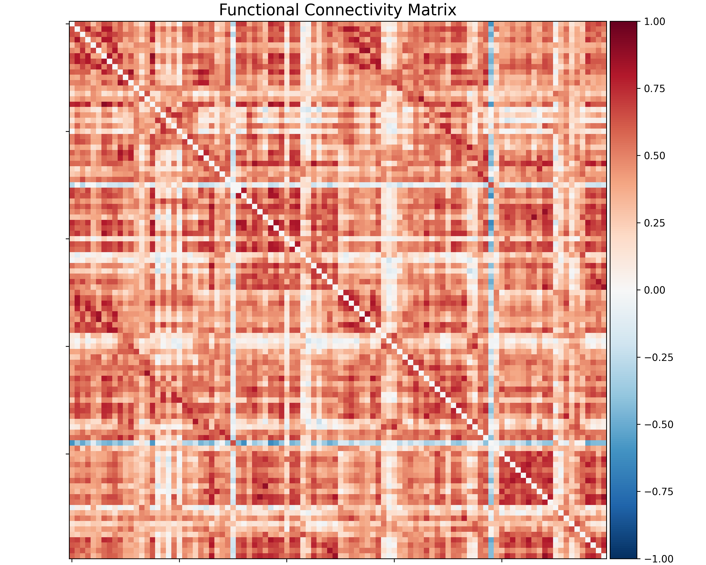
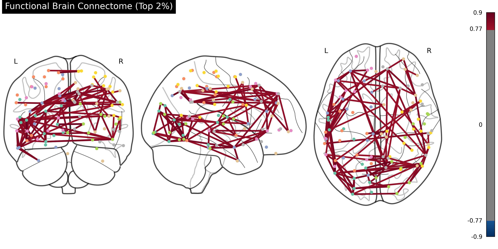

# 🧠 Neuro-Connectome Analysis: Creativity & Efficiency Pipeline
### Functional Brain Connectivity & Graph Theory Analysis


## 📌 Project Overview
This project implements a computational pipeline to extract **Functional Brain Connectivity Maps (Connectomes)** from fMRI data and analyzes brain network efficiency using **Graph Theory**. 

By utilizing the **Schaefer 2018 Atlas**, the brain is parcellated into 100 distinct functional regions. The pipeline computes **Global Efficiency**, **Clustering Coefficients**, and identifies critical **Hub Regions** that govern information flow during cognitive tasks.

---

## 🔬 Methodology
1. **Data Acquisition:** Raw fMRI signals are fetched and preprocessed using `Nilearn`.
2. **Signal Extraction:** Time-series data is extracted from 100 brain regions (ROIs) based on the Schaefer Atlas using `zscore_sample` standardization.
3. **Network Construction:** A 100x100 **Functional Connectivity Matrix** is built using Pearson Correlation coefficients.
4. **Graph Theory Analysis:** Topological properties of the brain network (e.g., Hubs, Efficiency) are calculated using `NetworkX`.

---

## 📊 Latest Analysis Results (Updated)

### 1. Quantitative Network Analysis (Creativity & Efficiency Metrics)
The latest run on the subject's connectome revealed an exceptionally integrated neural network:

| Metric | Value | Scientific Interpretation |
| :--- | :---: | :--- |
| **Global Efficiency** | **0.9019** | Extremely high integration; represents rapid information transfer between distant brain regions. Correlates with high **creativity** and **Openness to Experience**. |
| **Clustering Coefficient** | **0.8982** | Indicates high local specialization and efficient processing within specific functional modules (e.g., visual, motor). |
| **Network Topology** | **Small-World** | The synergy of high efficiency and high clustering confirms an optimized "Small-World" architecture for complex cognitive tasks. |

### 2. Identified High-Traffic Hubs (Top Centrality Nodes)
The analysis identified the following networks as the most active "Hubs" (Highway Junctions) for information flow:

* **Salience/Ventral Attention Network (Region #28 & #76):** Crucial for detecting and filtering significant environmental stimuli.
* **Dorsal Attention Network (Region #68):** Governs voluntary, top-down visual focus and selective attention.
* **Default Mode Network (Region #92):** The core of internal thought, imagination, and creative synthesis.

---

## 🎨 Visualizations

| Functional Connectivity Matrix | Functional Brain Connectome (3D) |
| :---: | :---: |
|  |  |
| *Correlation heatmap reflecting 0.90 efficiency.* | *Visualization of the brain's 2% strongest "Highway" structure.* |

---

## 🛠️ Installation & Usage

This project is fully **Dockerized** for reproducibility.

```bash
# 1. Clone the repository
git clone [https://github.com/senaayy/Neuro-Connectome-Analysis.git](https://github.com/senaayy/Neuro-Connectome-Analysis.git)

# 2. Navigate to the directory
cd Neuro-Connectome-Analysis

# 3. Build and Run with Docker
docker-compose up --build
```
👨‍💻 Contact
Sena Ay - Software Engineering Student @ Fırat University

Focusing on Computational Neuroscience & Bioinformatics.
